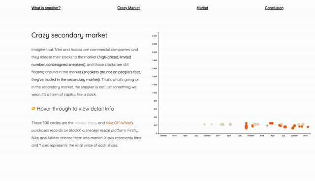

# Final Project: Data Story

### Project Name: [When Sneaker Become Capital: An Intro to Sneaker Market](https://kenneth233.github.io/)

### NYU Shanghai Interactive Media Arts | Critical Data & Visualization Spring 2020

### About this project

This project is based on the sample dataset of Adidas Yeezy & Nike Off-White sneaker resale records(2017-2019) from StockX, a sneaker resale platform. This sample dataset consist of many detailed aspects of sneaker resale transaction, including sneaker release date, order date on StockX, retail prices, resale prices, etc.

There are three visualization in my project: "Transition from retail to resale", "Profits of each sneaker resale trade" and "US sneaker resale market". "Transition from retail to resale" show how the prices of sneaker change between the time of their first release and the time when they were resold on StockX, and show the time difference between retail date and resale date; "Profits of each sneaker resale" reveal how big the price difference of each sneaker secondary transaction it is; "US sneaker market" draw out the US sneaker secondary market distribution, introducing how many people purchased resale sneaker in each state.

All these visualization intend to provide an analysis on sneaker's **"capital features"** to the audience:
*Similar to stock, sneaker(especially those co-designing, limited version shoes) may experience huge prices floating. Also, they may be on the secondary market instead of on people's feet for a long time.*

Through this project, I hope to deliver a concept to my audience, which:
 **sneaker are not just the shoes we wear not; sometimes they will be something like stocks or anything related to finance and marketing.**

Hope my project can bring new insights to you! Enjoy it!

### Data source & Context reference

[StockX data contest](https://stockx.com/news/the-2019-data-contest/)
[Shoppers are now willing to drop hundreds of dollars on sneakers — and they might need to spend even more in the future-Business insider](https://www.businessinsider.com/sneaker-prices-costs-expensive-shoes-footwear-2019-7)
